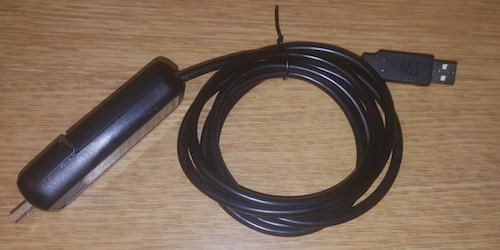

# keyboard_automator_emulator
This project allows you to use the terminal of one computer (tested with Mac) as a keyboard for another computer. In addition, it will read text or markdown files. On the leader (keyboard) computer you can use your arrow keys to scroll down through the text and simply hit enter to send the text from that line over to the other computer.  This saves you from having to type something that has already been typed by others.  

It's particularly useful when you are reading instructions on one computer and need to execute commands on another computer.  This is particularly useful for someone like me who tends to make a lot of typos when typing complex bash commands.  See this video for an overview of the project: https://youtu.be/B_2JoDEWHWE

This project consists of two parts.  A USB to USB convertor cable that connects two computers together.  And a C program that reads a text or markdown file and sends text out the serial port through the USB to USB convertor cable to the computer you want to control.     

First, let's look at the USB to USB convertor cable.  Here's what mine looks like: 

Here's what you will need to build your cable (affiliate links):  

[USB to TTL Serial 3.3V UART Converter Cable with FTDI Chip!](https://www.amazon.com/gp/product/B06ZYPLFNB/ref=as_li_tl?ie=UTF8&camp=1789&creative=9325&creativeASIN=B06ZYPLFNB&linkCode=as2&tag=hightechhoste-20&linkId=fa771f621f446405b7e19dc82cddf165)

[Teensy LC USB Development Board Without Pins](https://www.amazon.com/gp/product/B01BMRTZGE/ref=as_li_tl?ie=UTF8&camp=1789&creative=9325&creativeASIN=B01BMRTZGE&linkCode=as2&tag=hightechhoste-20&linkId=f3c548810fa16a25ee8ba9ae16105a44)

Micro USB Cable - You probably have a few of these laying around but it needs to be able to pass data.  Some micro USB cables are only good for charging your devices.   If you can't program your Teensy, then you probably have a bad cable. 

A plastic box to put it all in.  

####Hardware
Here's the schematic to hook everything up: 

To program the Teensy you will need Teensyduino. The normal Arduino IDE will not work.  Plug the the USB A side of the Micro USB cable into your computer and plug the micro USB side into your TeensyLC.  Load the keyboard_automator_emulator.ino in this repository into Teensyduino, go to Tools > Board: Arduino Yun > Teensyduino > Teensyduino LC

Go to Sketch > Include Library > Keyboard

Click verify, then Upload.  Teensyduino should prompt you to push the button on the TeensyLC.  

If everything worked your hardware is ready to go.  

####Software
itext viewer app that can automatically send lines of text out through the serial port of one computer to an Arduino Teensy to another another computer via USB.  This means you don't have to type long complicated commands if someone has already typed this out for you.   

More documentation to follow (especially upon request). 

A video explanation of this project is located at https://youtu.be/B_2JoDEWHWE

## USAGE
./s2s /path/to/text/file/example.md /dev/cu.usbserial-FTGNRR7Z

cu.usbserial-FTGNRR7Z refers to the serial port that has been exposed in your devices directory when the Aruduino is plugged in.  Your port will vary from what's shown above.  

Thanks to my friend Akos for helping with the programming.   
